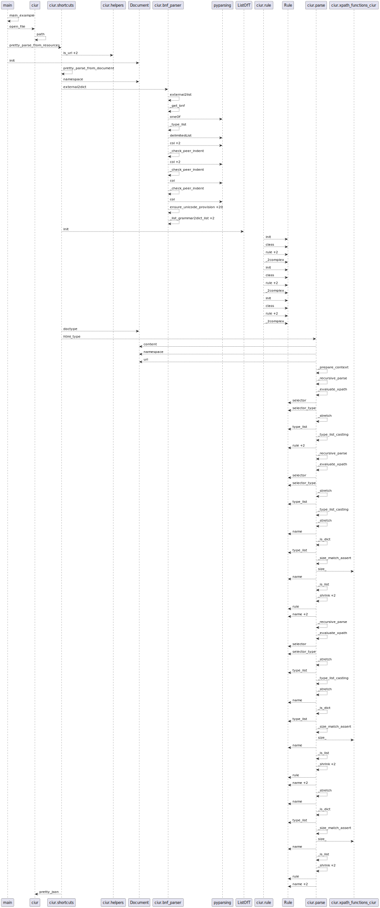

In this example we will trace workflow from a scrapper implementation https://bitbucket.org/ada/python-ciur/src/python3.9-ciur/.

1. Install plantuml

.. code-block:: bash

    # macOS
    brew install plantuml

    # debian
    sudo apt update -y
    sudo apt install -y plantuml

2. create virtual env, and update pip and wheel

.. code-block:: bash

    python3 -m venv venv
    venv/bin/pip install -U pip wheel

3. install example requirements lib

.. code-block:: bash

    venv/bin/pip install -r requirements.txt

4. Test normal workflow without pylant

.. code-block:: bash

    $ venv/bin/python example.py main-example
    2022-07-07 00:11:54,966 [INFO] pretty_parse_from_resources(146) - Downloading document to parse 'http://example.org'
    {
        "root": {
            "name": "Example Domain",
            "paragraph": "This domain is for use in illustrative examples in documents. You may use this\n    domain in literature without prior coordination or asking for permission."
        }
    }

5. Test example workflow without pylant

.. code-block:: bash

    $ export PYTHONPATH=..:$PYTHONPATH
    $ venv/bin/python example.py patched-example
    2022-07-11 12:07:32,823 [INFO] pretty_parse_from_resources(146) - Downloading document to parse 'http://example.org'
    {
        "root": {
            "name": "Example Domain",
            "paragraph": "This domain is for use in illustrative examples in documents. You may use this\n    domain in literature without prior coordination or asking for permission."
        }
    }
    Save calls to /Users/user_name/github.com/pylant/example.d/sequence.plantuml

6. Render the sequence.plantuml into a image

.. code-block:: bash

    $ head -n 5 sequence.plantuml
    @startuml
    __main__ --> __main__: main_example
    __main__ --> ciur: open_file
    ciur --> ciur: path
    __main__ --> ciur.shortcuts: pretty_parse_from_resources

    $ plantuml -tsvg -progress sequence.plantuml
    [##############################] 1/1
    $ du -h *.svg
    60K    sequence.svg

4. Analyze the image

